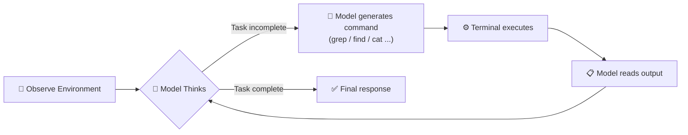

The AI coding tool landscape has shifted. Cursor was the dominant player — the IDE everyone recommended. Now developers are switching to Claude Code in droves. The reason isn't just model capability. It's a fundamental difference in how each tool thinks about the relationship between a model and a codebase.

## How Cursor Works: Index First, Query Later

Cursor's core approach is to build a middle layer between the model and your code. When you open a project, it indexes the entire codebase — embedding code chunks into a local vector database. When the model needs to understand something, it queries this database via RAG (Retrieval-Augmented Generation) to pull in relevant snippets.

This sounds reasonable, but it creates real problems in practice:

- **Indexing is expensive**: Large codebases require significant compute to embed. And it's not just the main branch — switching branches, editing files, all of it may trigger incremental re-indexing.
- **Sync complexity**: Code changes constantly. Keeping the vector database up to date requires file watching, incremental updates, and conflict handling — a whole engineering problem unto itself.
- **Retrieval quality is inconsistent**: RAG depends heavily on embedding quality and retrieval strategy. Code isn't natural language. Function names, variable relationships, and call hierarchies don't always survive the embedding process. Ask for a function definition and you might get back a block of comments.

To be fair, Cursor isn't just RAG. It also uses tree-sitter for syntax analysis, file reference tracking, and other techniques. But the overall philosophy is the same: **pre-process the codebase into a compressed, queryable form, then teach the model how to use it.**

## How Claude Code Works: Give the Model a Terminal

Claude Code takes a radically different approach. No index. No vector database. No embeddings. Its strategy is almost embarrassingly simple — give the model terminal access and let it read the code directly.

Need to search for something? `grep`. Need to find files? `find`. Need to read a file? `cat`. Need the project structure? `ls` and `tree`.

These are the most basic Linux/Unix commands. The model has seen thousands of examples of them in training. It doesn't need to learn a new API. It doesn't need to understand a custom retrieval interface. It just does what it already knows how to do — **use the command line like an experienced developer.**

## The Core Difference: Should You Invent New Tools for the Model?

This is where the philosophies diverge most sharply.

Cursor's reasoning: context windows are limited, so we can't feed the model all the code. We need to pre-filter information — build indexes, run retrieval, selectively provide context. Then we need to **teach the model to use the retrieval tool we invented**.

The problem is that "teaching the model" part. When you give a model a custom tool it has never encountered in training, you have to explain it through a system prompt: what it does, what parameters it takes, when to call it, how to interpret the response. Can the model learn? Yes — but reliability suffers. It may call the tool at the wrong time, use the wrong parameters, or misread the output. **A model's ability to use unfamiliar tools is far weaker than its ability to use tools it's seen thousands of times.**

Claude Code flips this entirely: don't invent new tools. **Give the model tools it already knows.** `grep`, `find`, `cat`, `ls` — the training corpus is full of these. The model doesn't just know the syntax; it knows which flags to use in which situations, how to chain commands together, when to try a different approach. That depth of knowledge can't be injected through a system prompt.

## The Underlying Bet: Models Are Smart Enough Now

Claude Code's design rests on a key conviction: **today's large language models are capable enough to explore a codebase on their own.**

You don't need to pre-process information for them. You don't need to build indexes or pre-filter context. You just need to give them a familiar set of tools and get out of the way. The model will look around the project structure, find the relevant files, read the code, and make changes — the same way a good developer would.

This "less is more" philosophy has been validated by Claude Code's results. No complex scaffolding. No extra abstraction layers. The model's behavior is more predictable and more reliable precisely because there's less between it and the code.

## In Fairness: Cursor Has Real Advantages Too

This isn't a one-sided story. Cursor's approach has genuine strengths:

- **Speed**: Vector search completes in milliseconds. `grep`-ing a large codebase can take seconds. For very large repos, pre-built indexes have a real performance edge.
- **Token efficiency**: RAG can surgically extract the most relevant code snippets into the context window, consuming fewer tokens. Claude Code sometimes reads several files before zeroing in on the right one.
- **IDE integration**: Cursor, as a full IDE, can leverage the syntax tree, type information, and symbol navigation that editors provide natively — things a CLI tool simply can't access.

But in practice, Claude Code's approach of trusting the model, reducing indirection, and using familiar tools has proven more effective overall.

## The Takeaway

Claude Code's success carries an important lesson for AI product design: **rather than building new tools and teaching the model to use them, let the model use the tools it already knows.** A model's tool-use capability isn't unlimited — its mastery of familiar tools vastly outpaces its ability to learn new ones.

Zooming out, this reflects a broader trend in AI application development: as foundation models get more capable, the scaffolding built around them should get lighter. **The best AI tool isn't the one that adds the most assistance. It's the one that gets in the way the least.**
