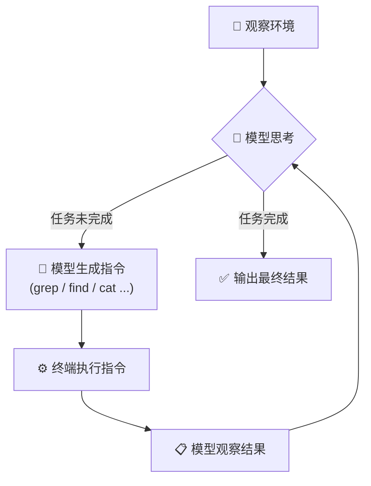

最近 AI 编程工具的风向变了。之前 Cursor 是最火的 AI 编程助手，但现在越来越多开发者转向了 Claude Code。这个转变背后，不只是模型能力的差距，更根本的是两者在"如何让模型与代码库交互"这件事上，走了完全不同的路。

## Cursor 的方式：先建索引，再查询

Cursor 的核心思路是在模型和代码库之间建一个中间层。它会在项目打开时对整个代码库做索引——利用 embedding 将代码切片后存入本地向量数据库，检索时通过 RAG（Retrieval-Augmented Generation）的方式匹配相关代码片段，再喂给模型。

这个方案听起来很合理，但实际操作中问题不少：

- **索引成本高**：代码库一大，embedding 的计算量就上去了。而且不只是 main 分支，你切到其他分支、改了几行代码，索引可能就需要增量更新。
- **同步问题复杂**：代码在不断变化，索引数据库需要实时或近实时地跟上。这涉及到文件监听、增量更新、冲突处理等一系列工程难题。
- **检索质量不稳定**：RAG 的效果很依赖 embedding 的质量和检索策略。代码不是自然语言，函数名、变量名、上下文关系这些东西，embedding 不一定能很好地捕捉。有时候你想找一个函数的定义，RAG 返回的却是一堆注释。

当然，Cursor 并非只靠 RAG。它也使用了 tree-sitter 做语法分析、文件引用追踪等技术来辅助理解代码结构。但从整体架构来看，它的思路是：**先把代码库的信息提炼、压缩、存储起来，再教模型怎么去查这些信息。**

## Claude Code 的方式：把终端交给模型

Claude Code 的做法截然不同。它没有建任何索引，没有向量数据库，也不做 embedding。它的策略极其朴素——直接把终端工具交给模型，让模型自己去读代码。

需要搜索代码？用 `grep`。需要查找文件？用 `find`。需要看文件内容？用 `cat`。需要了解项目结构？用 `ls` 和 `tree`。

这些都是最基础的 Linux/Unix 命令，模型在训练阶段已经见过海量的使用示例。它不需要学习任何新的 API，不需要理解任何自定义的检索接口，它只需要做它已经很擅长的事情——**像一个经验丰富的开发者一样使用命令行工具。**

## 核心差异：要不要给模型发明新工具？

这里有一个很深刻的设计哲学差异。

Cursor 的思路是：模型的上下文窗口有限，不可能把所有代码都塞进去，所以我们需要帮模型做信息筛选——建索引、做检索、选择性地提供上下文。然后我们需要**教模型使用我们发明的检索工具**。

问题在于"教模型"这一步。当你给模型一个它从未在训练数据中见过的自定义工具时，你需要通过 system prompt 解释这个工具是什么、接受什么参数、在什么场景下该调用、返回结果怎么解读。模型能学会用吗？能，但效果往往不够好。它可能在不该调用的时候调用，用错参数，或者误解返回结果。**模型使用未知工具的可靠性，远不如使用它在训练中大量见过的工具。**

Claude Code 的思路恰恰相反：不要给模型发明新工具，而是**让模型使用它已经熟悉的工具**。`grep`、`find`、`cat`、`ls` 这些命令，训练数据里有无数的使用范例。模型不仅知道怎么用，还知道在什么场景下用什么参数组合最有效。这种"内化的知识"是通过 system prompt 教不出来的。

## 这背后的信念：模型已经够聪明了

Claude Code 的设计背后有一个关键判断：**当前的大语言模型已经足够聪明，能够自主决定如何探索一个代码库。**

你不需要帮它预处理信息，不需要帮它建索引，不需要帮它筛选上下文。你只需要给它一套它熟悉的基础工具，给它足够的自由度，让它像一个真正的开发者一样去工作：先看看项目结构，再找到相关文件，读懂代码逻辑，然后做出修改。

这种"少即是多"的设计哲学，在 Claude Code 身上得到了验证。它不需要复杂的外挂系统，反而因为没有这些额外的抽象层，模型的行为更加可预测、更加可靠。

## 公平地说：两者各有取舍

当然，也不是说 Cursor 的方案毫无优势：

- **速度**：索引查询可以在毫秒级完成，而 `grep` 一个大型代码库可能需要几秒。对于超大型代码库，预建索引在检索速度上是有优势的。
- **上下文效率**：RAG 可以精准地把最相关的代码片段放进上下文窗口，减少 token 消耗。而 Claude Code 有时会读很多不必要的文件来"理解"代码库，会消耗更多 token。
- **IDE 集成**：Cursor 作为 IDE 可以利用语法树、类型信息、符号跳转等编辑器原生能力来辅助模型理解代码，这是纯命令行工具做不到的。

但从实际使用效果来看，Claude Code 选择信任模型的能力，减少中间层，用熟悉的工具让模型自由发挥，这条路确实走得更远。

## 总结

Claude Code 的成功给 AI 工具设计带来了一个重要启示：**与其花大力气发明新工具再教模型使用，不如让模型用它已经会的工具。** 模型的"工具使用能力"不是无限的——它对熟悉工具的掌握程度远超对新工具的学习能力。

站在更高的视角看，这也反映了 AI 应用开发中的一个趋势：随着基础模型越来越强，围绕模型构建的"脚手架"反而应该越来越轻。**最好的 AI 工具，不是给模型加最多辅助的那个，而是最少阻碍模型发挥的那个。**
